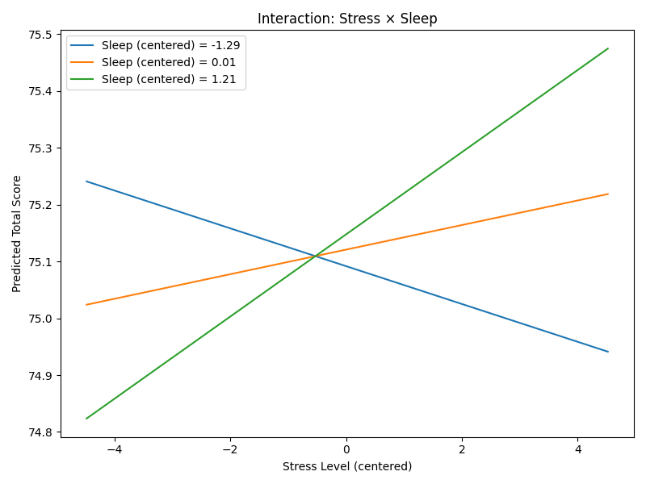
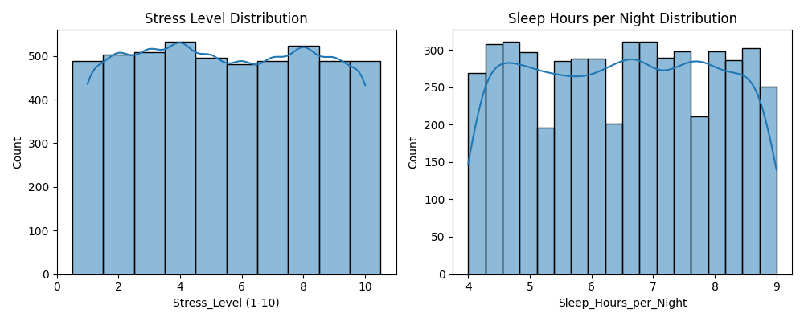

# 📘 Student Performance & Cognitive Factors — README

## 📌 Project Description  
This project analyzes the **Student Performance & Behavior Dataset** to investigate how **stress levels** and **sleep duration** interact and influence students’ academic outcomes.  
The core hypothesis:  
> *Stress_Level negatively impacts Total_Score, but sufficient Sleep_Hours_per_Night may buffer this effect.*

### 🎯 Main Objectives  
- Understand the structure and biases of the dataset.  
- Clean and preprocess academic, demographic, and behavioral features.  
- Explore correlations between stress, sleep, and academic performance.  
- Build a regression model to test whether sleep moderates the effect of stress.  
- Use Unsupervised Learning (K-means) to identify student profiles based on lifestyle and performance.
- Identify potential thresholds where stress begins to significantly reduce performance.

### 🧩 Assumptions  
- Stress_Level and Sleep_Hours_per_Night are self‑reported but reliable enough for modeling.  
- Total_Score is a weighted metric and not a simple average.  
- Missing values are random and can be imputed without introducing systematic bias.

### 🧪 Hypothesis  
1. Higher stress correlates with lower academic performance.  
2. Sleep moderates the relationship: students with 7–8 hours of sleep show greater resilience to stress.  
3. There may be a stress “tipping point” where performance drops sharply.
4. Cluster Hypothesis: Distinct groups of students (e.g., "High Stress/Low Sleep") will show significantly different academic trajectories.

---

## 📂 Project Structure

```
project_root/
│
├── data/
│   └── Students_Grading_Dataset_Biased.csv
│
├── src/
│   ├── data_loading.py
│   ├── data_cleaning.py
│   ├── feature_engineering.py
│   ├── modeling.py
│   ├── analysis/
│       ├── eda_components.py
        ├── eda_basic.py
        ├── eda_advanced.py
        ├── model_analysis.py
        └── model_diagnostics.py
│   ├── visualization_basic.py
    └── visualization_advanced.py
│
├── tests/
│   ├── test_data_loading.py
│   ├── test_data_cleaning.py
│   ├── test_feature_engineering.py
│   ├── test_modeling.py
    ├── test_pca_clustering.py
│   └── test_analysis.py
│
├── main.py
├── requirements.txt
└── README.md
```

---

## 🧵 Key Stages & What Was Done

### **1. Data Import**
- Load the CSV dataset.  
- Validate column types and detect missing values.  
- Log dataset shape and anomalies.

### **2. Data Processing**
- Impute missing values (Attendance, Assignments_Avg, Parent_Education_Level).  
- Encode categorical variables (Gender, Department, Parent_Education_Level, etc.).  
- Normalize or scale numeric features where needed.

### **3. Feature Engineering**
- Create interaction term:
    Stress x Sleep
- Validate distributions and detect outliers.
- Construct modeling-ready dataset.

### **4. Exploratory Analysis (Basic & Advanced)**
- 	Correlation analysis between stress, sleep, and performance
- 	PCA for dimensionality reduction
- 	K‑means clustering to identify student profiles
- 	Cluster interpretation and validation

### **5. Modeling**
- Pearson correlation analysis between stress, sleep, and Total_Score.  
- Multiple linear regression with interaction term.  
- Evaluate significance (p-values), effect sizes, and model fit.
- Implementing K-means Clustering to segment the student population.

### **6. Analysis**
- Identify stress thresholds where performance declines.  
- Compare performance across sleep ranges (e.g., <6, 6–7, 7–8, >8 hours).  
- Interpret moderation effect.

### **7. Visualization**
- Correlation heatmaps.  
- Regression plots with interaction effects.  
- Stress vs. Total_Score curves with sleep-level overlays.
- Cluster distributions.

---

### 📊 Key Analysis Visualizations

#### 1. Interaction Effect: Stress, Sleep, and Performance
This graph illustrates our core hypothesis. It shows how the relationship between stress levels and total scores changes based on the amount of sleep a student gets. 
- **Slopes:** A steeper decline in the "Low Sleep" group compared to the "High Sleep" group indicates that sleep acts as a protective buffer against stress.


#### 2. Stress and Sleep Distributions
This visualization shows the distribution of our two primary independent variables across the entire dataset. It helps identify the most common stress levels and sleep patterns among the students.


---

## 📊 Data Description & Dataset Link

**Dataset:** *Students_Grading_Dataset_Biased.csv*  
**Rows:** 5,000  
**Columns:** 23  

### Key Variables  
| Column | Description |
|--------|-------------|
| Stress_Level | Self-reported stress (1–10) |
| Sleep_Hours_per_Night | Avg. nightly sleep hours |
| Total_Score | Weighted academic performance |
| Attendance (%) | Attendance rate |
| Assignments_Avg | Avg. assignment score |
| Parent_Education_Level | Highest parental education |
| Family_Income_Level | Low/Medium/High |
| … | Additional demographic & academic features |

---


## 📚 References  
McEwen, B. S. (1998). Stress, adaptation, and disease: Allostasis and allostatic load. Annals of the New York Academy of Sciences, 840(1), 33–44. https://doi.org/10.1111/j.1749-6632.1998.tb09546.x
Lupien, S. J., McEwen, B. S., Gunnar, M. R., & Heim, C. (2009). Effects of stress throughout the lifespan on the brain, behaviour and cognition. Nature Reviews Neuroscience, 10(6), 434–445. https://doi.org/10.1038/nrn2639
Curcio, G., Ferrara, M., & De Gennaro, L. (2006). Sleep loss, learning capacity and academic performance. Sleep Medicine Reviews, 10(5), 323–337. https://doi.org/10.1016/j.smrv.2005.11.001
Walker, M. P. (2009). The role of sleep in cognition and emotion. Annals of the New York Academy of Sciences, 1156(1), 168–197. https://doi.org/10.1111/j.1749-6632.2009.04416.x
Aiken, L. S., & West, S. G. (1991). Multiple regression: Testing and interpreting interactions. Sage Publications.

- Course materials and statistical modeling guidelines.

---

## ▶️ Instructions for Running the Project

### **1. Install Dependencies**
```bash
pip install -r requirements.txt
```

### **2. Run the Full Pipeline**
```bash
python main.py
```

### **3. Run Tests**
```bash
pytest tests/
```

---

## 🧪 Tests Directory — What’s Covered  
Each major stage has a dedicated test file:

- **test_data_import.py** — Ensures dataset loads correctly and required columns exist.  
- **test_data_cleaning.py** — Validates missing-value handling and type conversions.  
- **test_feature_engineering.py** — Confirms creation of interaction terms and transformations.  
- **test_modeling.py** — Checks model training, coefficients, and expected output structure.
- **test_pca_clustering.py** — Verifies the dimensionality reduction process (PCA) and ensures consistent cluster assignment logic for student profiling.  
- **test_analysis.py** — Ensures statistical tests return valid metrics.

Successful execution confirms that each stage meets its intended assumptions.

---

## 🧱 Main Script (main.py)

The main script contains only high-level orchestration:

- Load data  
- Clean data  
- Engineer features  
- Train model  
- Run analysis  
- Generate visualizations  

All heavy logic resides in modular functions inside `src/`.

---

## 📝 Logging Best Practices  
- All modules use Python’s `logging` library.  
- No `print()` statements appear in production code.  
- Logs include timestamps, module names, and severity levels.

---

## 🏷️ Naming Conventions  
- Project name: **student-performance-cognitive-analysis**  
- All Python files use `snake_case`.  
- No raw numbers or strings passed directly into functions — only named variables.  
- Functions remain short (<50 lines) and modular.

---

## 🧭 Kick-Off Guidelines (Completed)

- Dataset fully understood.  
- Challenges identified: missing values, biased grading, imbalanced departments.  
- Unexpected challenges considered: multicollinearity, non-linear stress effects.  
- Effort estimation and work plan defined.  
- Evaluation strategy: statistical significance, effect size, visual clarity.